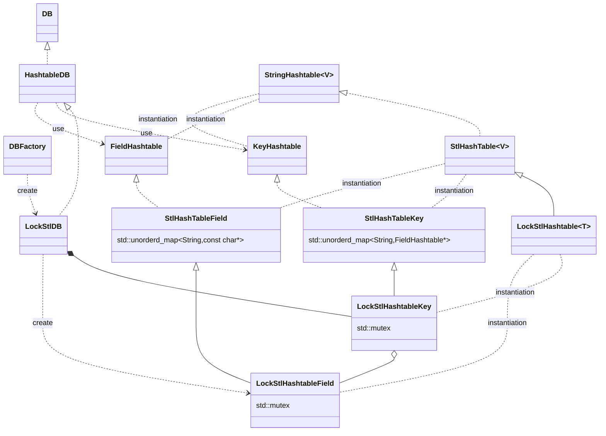

# kvs-evaluation
```bash
cd external/YCSB-C

# sudoを使ってlibhiredis.soが/usr/local/libにインストールされる
make
export LD_LIBRARY_PATH=/usr/local/lib

# 動作確認
./ycsbc -db basic -threads 1 -P workloads/workloada.spec
```

# YCSB-C

