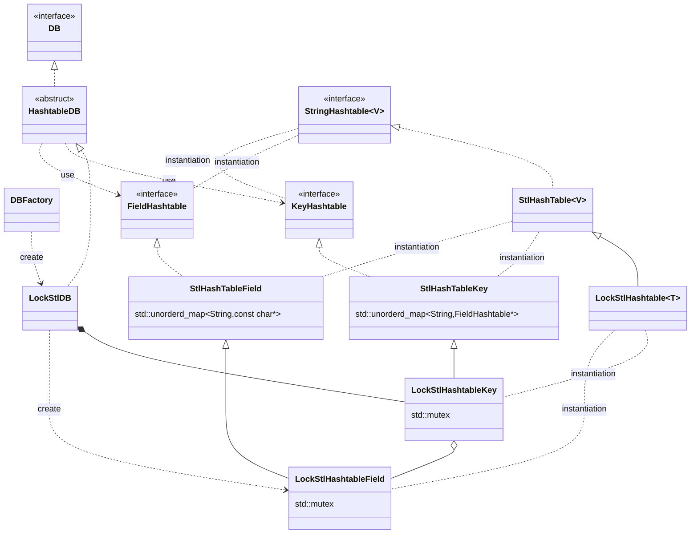

# kvs-evaluation
```bash
cd external/YCSB-C

# sudoを使ってlibhiredis.soが/usr/local/libにインストールされる
make
export LD_LIBRARY_PATH=/usr/local/lib

# 動作確認
./ycsbc -db basic -threads 1 -P workloads/workloada.spec
```

# YCSB-C
## workload
| workload | description       | read | insert | update | scan | R-M-W | distribution |              remarks              |
| :------- | :---------------- | ---: | -----: | -----: | ---: | ----: | :----------: | :-------------------------------: |
| A        | Update heavy      |  0.5 |        |    0.5 |      |       |   zipfian    |                                   |
| B        | Read mostly       | 0.95 |        |   0.05 |      |       |   zipfian    |                                   |
| C        | Read only         |    1 |        |        |      |       |   zipfian    |                                   |
| D        | Read latest       | 0.95 |   0.05 |        |      |       |    latest    |                                   |
| E        | Short ranges      |      |   0.05 |        | 0.95 |       |   zipfian    | maxscanlength=100 random(uniform) |
| F        | Read-modify-write |  0.5 |        |        |      |   0.5 |   zipfian    |                                   |

## class diagram (subset)

